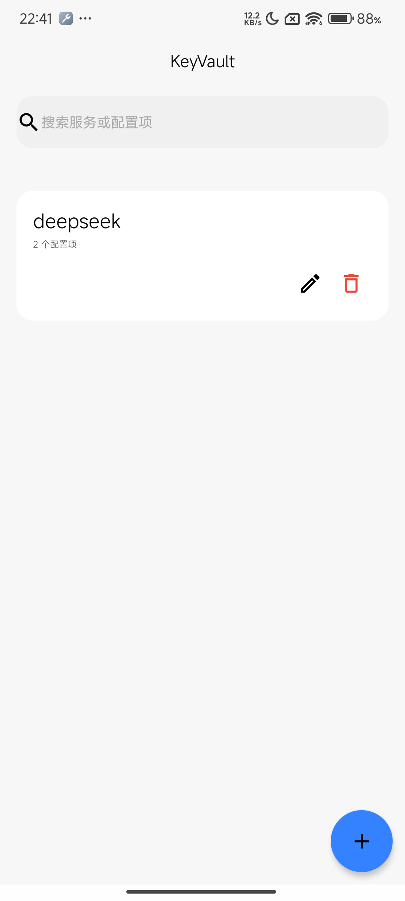
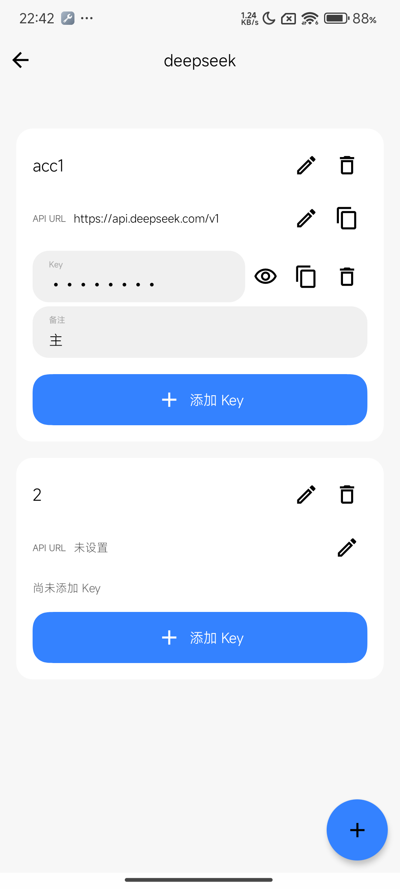
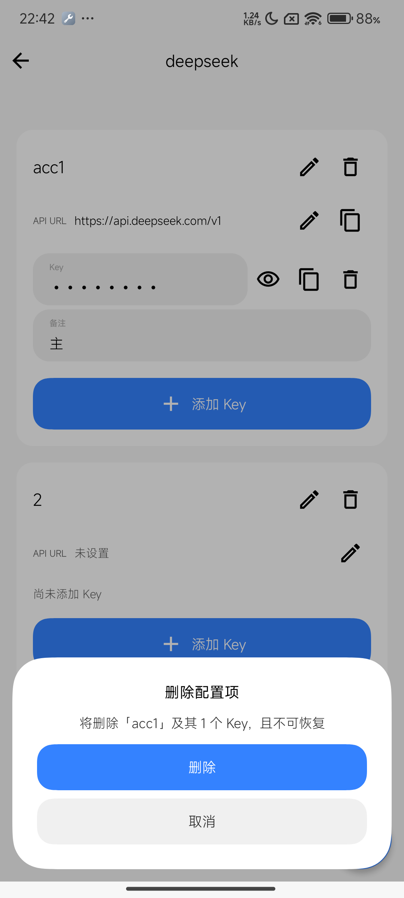

# KeyVault

一个简洁的 Android API Key / 密钥管理应用，基于 Jetpack Compose 与 [Miuix](https://github.com/compose-miuix-ui/miuix)（HyperOS 风格 UI）构建。

按「服务 → 配置项 → Key」三级组织你的密钥：每个服务（如 deepseek、OpenAI）下可建多个配置项（如不同账号/环境），每个配置项包含 API URL 和若干 Key 与备注。

## 截图

<p align="center">
  
  
  
</p>

## 功能特性

- **三级密钥管理**：服务 → 配置项（API URL + Key 列表）→ Key（值 + 备注）
- **全局搜索**：按服务名、配置项名、URL、Key 值、备注检索
- **Key 值遮蔽**：默认密文显示，点击眼睛图标切换可见性
- **安全剪贴板**：Android 13+ 复制时标记敏感内容，剪贴板预览不泄露明文
- **防截屏**：`FLAG_SECURE` 阻止最近任务缩略图与截屏泄露
- **删除保护**：删除服务/配置项/Key 均需二次确认，并提示影响范围
- **本地存储**：数据仅存于本机 DataStore，已禁用云备份（`allowBackup=false`）
- **健壮持久化**：写入防抖、损坏数据容错、启动竞态保护

## 技术栈

- Kotlin + Jetpack Compose
- [Miuix](https://github.com/compose-miuix-ui/miuix) UI 组件库
- DataStore（JSON 序列化，以稳定 id 为 key，兼容旧格式迁移）
- ViewModel + StateFlow/SharedFlow

## 构建

```bash
./gradlew assembleDebug
```

要求：JDK 17+，Android SDK（minSdk 26 / targetSdk 36）。

## License

MIT
