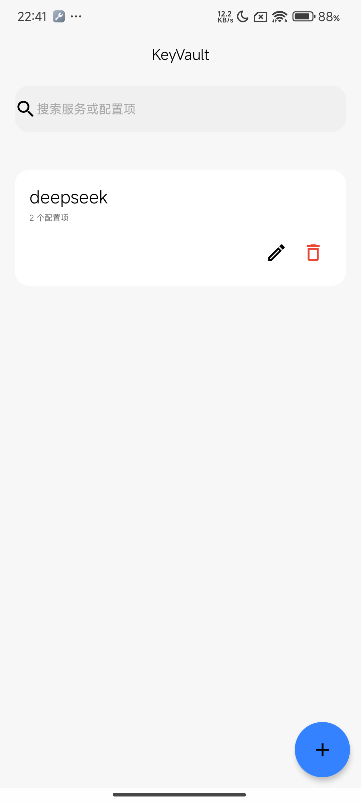
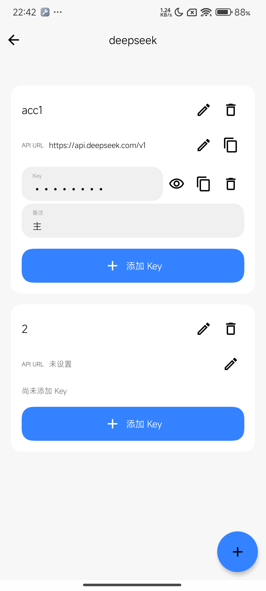
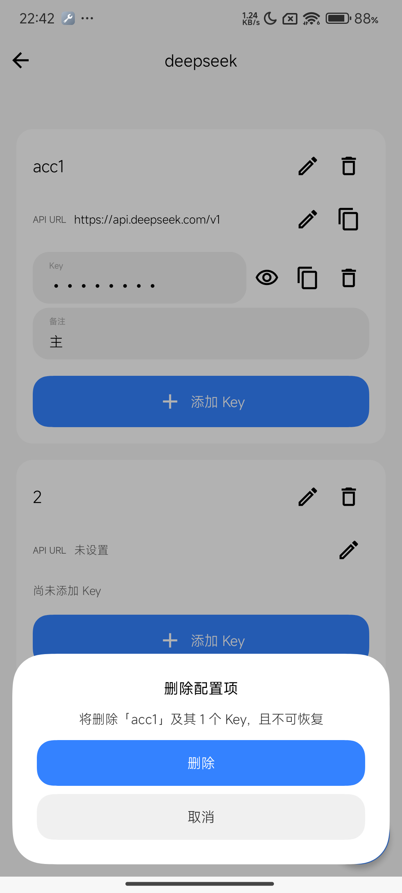

# KeyVault

一个简洁的 API Key / 密钥管理应用，基于 **Kotlin Multiplatform + Compose Multiplatform** 与 [Miuix](https://github.com/compose-miuix-ui/miuix)（HyperOS 风格 UI）构建，可运行于 Android 与桌面（Windows / macOS / Linux）。

按「服务 → 配置项 → Key」三级组织你的密钥：每个服务（如 deepseek、OpenAI）下可建多个配置项（如不同账号/环境），每个配置项包含 API URL 和若干 Key 与备注。

## 截图

<p align="center">
  
  
  
</p>

## 功能特性

- **三级密钥管理**：服务 → 配置项（API URL + Key 列表）→ Key（值 + 备注）
- **全局搜索**：按服务名、配置项名、URL、Key 值、备注检索
- **Key 值遮蔽**：默认密文显示，点击眼睛图标切换可见性
- **防截屏**：Android 上进入含明文 Key 的二级/三级页面自动启用 `FLAG_SECURE`
- **删除保护**：删除服务/配置项/Key 均需二次确认，并提示影响范围
- **本地存储**：数据仅存于本机 DataStore，Android 端已禁用云备份（`allowBackup=false`）
- **健壮持久化**：写入防抖、损坏数据容错、启动竞态保护
- **跟随系统亮暗**：自动适配系统深色模式，Android 上状态栏/导航栏图标颜色同步（无手动开关，只跟随系统）
- **多配置文件**：可保存多份独立配置，首页左上角一键切换；配置管理页支持新建、重命名、删除、导出
- **导入 / 导出备份**：导出为 JSON 文件（Android 走系统文件选择器，桌面走原生保存对话框）；**导入永远是新增一份配置，不会覆盖现有数据**

## 备份文件格式

```json
{ "format": 1, "name": "配置 2", "services": { "<id>": { "name": "...", "items": { ... } } } }
```

导入时若文件没有 `services` 键，会把整个文档当作 services 解析，因此早期版本的裸 JSON 导出也能直接导入。

## 多配置文件与数据迁移

1.1.0 起数据按「配置文件」组织。旧版本（只有一份服务列表）升级后会自动迁移为名为「默认配置」的配置文件，**数据不会丢失**。

## 模块结构

| 模块 | 说明 |
| --- | --- |
| `:shared` | KMP 库（androidTarget + jvm），含数据层、ViewModel 与全部 Compose UI |
| `:androidApp` | Android 应用壳：Activity、Application、签名配置、资源 |
| `:desktopApp` | 桌面应用壳：Compose Desktop 窗口入口 |

平台差异统一收敛到 `shared/src/<平台>Main/kotlin/cn/lemwood/keyvault/platform/`：

| expect | Android actual | Desktop actual |
| --- | --- | --- |
| `createVaultDataStore()` | `filesDir/datastore/vault.preferences_pb`（与旧版同路径，数据无损升级） | `~/.keyvault/vault.preferences_pb` |
| `platformAppVersion()` | PackageInfo 版本名 | 常量 |

## 技术栈

- Kotlin Multiplatform + Compose Multiplatform
- [Miuix](https://github.com/compose-miuix-ui/miuix) UI 组件库（`top.yukonga.miuix.kmp`）
- DataStore（多平台版，JSON 序列化，以稳定 id 为 key，兼容历史三层旧格式）
- ViewModel（多平台版）+ StateFlow/SharedFlow
- 存储格式不变：Android 端仍写同一个 `.preferences_pb` 文件，老版本升级不会丢数据

## 构建

```bash
# Android
./gradlew :androidApp:assembleDebug          # 或 :androidApp:assembleRelease

# 桌面
./gradlew :desktopApp:run                    # 直接运行
./gradlew :desktopApp:packageDistributionForCurrentOS   # 打包本机安装包
```

要求：JDK 17+（推荐 21），Android 端还需 Android SDK（minSdk 26 / targetSdk 36 / compileSdk 36）。

> Android 端依赖 `androidx-activity` ≥ 1.12.0：只有该版本起 `ComponentActivity` 才实现 `NavigationEventDispatcherOwner`，返回键事件才能正确传入 Compose。

Release 签名沿用 `keystore.properties` + `keyvault-release.jks`（均已在 `.gitignore` 中，不会入库），位于 `androidApp/` 模块配置里。

## License

MIT
